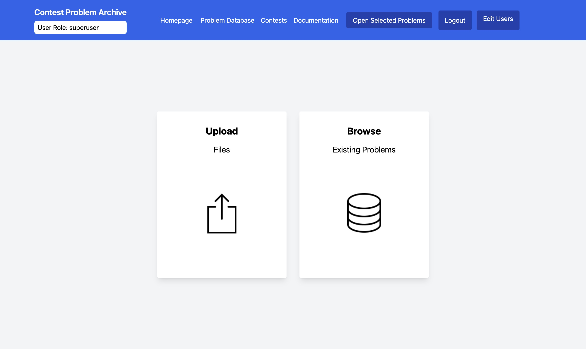

# Corpus App

            

[](https://opensource.org/licenses/MIT)

## About

This repository contains all project files and related resources for our CITS3200 project. It is split up into two sub-projects, **ContestScripts** and **CorpusApp**.

**Polygon &rarr; DOMjudge Conversion Script**

_This tool creates and converts [Polygon](https://polygon.codeforces.com/) formatted problem files into [ProblemTools](https://www.kattis.com/problem-package-format) formatted problem files, and generates problem tex files and the contest tex files. The tool also supports PDF generation for final contest distribution._

**CorpusApp**

_This is a full-stack application that together encompass a corpus for archiving and exporting Programming Contest Problems in the ProblemTools format. It supports user authentication, contest result statistics and filtering, as well as the ability to directly export to an external DOMJudge instance, or download selected problem files to your machine._

<!-- ABOUT THE PROJECT -->


## Contents

- [About](#about)
- [Polygon &rarr; DOMjudge Conversion](#polygon--domjudge-conversion)
- [CorpusApp](#corpusapp)
  - [Setup](#setup)
  - [Running the Application](#running-the-application)
  - [Usage](#usage)
    - [Problemlist Filtering](#problemlist-filtering)
    - [Uploading Problems and config.yaml](#uploading-problems-and-configyaml)
    - [API Reference and config.yaml Structure](#api-reference-and-configyaml-structure)
    - [User Roles](#user-roles)
    - [Final Miscellaneous Notes](#final-miscellaneous-notes)
- [Tests](#tests)
- [Technologies Used](#technologies-used)
- [License](#license)
- [Contact](#contact)

### Polygon &rarr; DOMjudge conversion

_This tool creates problem tex files and the contest tex file, PDFs are not automatically generated in case users need to make additional changes to the tex files. Ensure that all required images have been inserted into their correct locations before converting them into PDFs with your tool of choice._

\* This script was adapted for Polygon package to DOMjudge package conversion, from [Federico Glaudo](https://github.com/dario2994)'s [pol2dom tool](https://github.com/dario2994/pol2dom.git) as of 25th May 2023.

1. **Installation**:

   Ensure you have Python [version 3.11] installed. You can download it from [Python.org](https://www.python.org/downloads/).
   Install the required dependencies using `pip`:

   ```
   pip install -r requirements.txt
   ```

2. **Getting Started**:

   Clone this repository to your local machine and navigate into the ContestScripts directory:

   ```
   git clone https://github.com/bibyen/cits3200-project
   cd cits3200-project
   cd ContestScripts
   ```

3. **Preparing your contest's config.yaml**

The config.yaml file, which instructs p2d on the properties of the contest, must be present in the contest directory.
It must be a valid `yaml` file containing the following mandatory top-level keys:

- `contest_name`: The name of the contest.
- `problems`: This is a list of problems. A problem is a dictionary with the following keys:
  - `name`: Short-name, in Polygon, of the problem. This is used as identifier of the problem (denoted above as `problem_name`).
  - `label`: The label -- usually an uppercase letter -- used to identify the problem in the DOMjudge scoreboard. Problems will be appear in DOMjudge sorted according to this label.
  - `color`: Color of the problem in DOMjudge. It can be either the name of an HTML color (see the list https://htmlcolorcodes.com/color-names/) or the hexadecimal representation of a color (e.g., '#FF12AB'). If the hexadecimal representation is used, it must start with # and it must be enclosed in single or double quotes.
- `contest_title`: The title of the contest to appear in the contest latex file.
- `contest_shortname`: Short-name, included in the contest latex file.
- `problem_answer_details`: Problem clarifications.
- `definitions`: Contest definitions
- `contest_latex_filename`: Filename of the contest latex file, excluding the `.tex` extension.
- `header_logo_filename`: Filename of the header logo, exists as a link on the contest latex file.
- `contest_cover_filename`: Filename of the contest cover image, exists as a link on the contest latex file.
- `contest_date`: Date of the contest, to appear on the contest latex file.

\* A template `config.yaml` exists as `ContestScripts/config.yaml.template`.

\*\* An example `config.yaml` exists within `ContestScripts/testing/Testing-pol2dom`.

4. **Running the Script**:

Execute the main script by running the following command:

```
./p2d.sh absolute-path-to-contest-directory --convert
```

## CorpusApp

### Setup

These instructions will start a local copy of CorpusApp on localhost:3000 and localhost:3001 for the frontend and backend respectively.

1. **Installation**

Download and install [Node](https://nodejs.org/en/download/). Run

```
node -v
npm -v
```

to verify that Node and npm have been installed correctly.

2. **Cloning the Project**

Clone this repository to your local machine and navigate into the CorpusApp directory:

```
git clone https://github.com/bibyen/cits3200-project
cd cits3200-project
cd CorpusApp
```

3. **.env Files**

Two .env.example files located in client and server folder served as a template for .env file storing environment varables and configurations. Alternatively, alter these if you wish to change the ports or other environment variables.

4. **Installing Dependencies**

```
npm run setup
```

To install all dependencies for both client and server.

### Running the Application

Assuming .env files are set to your liking, run

```
npm run start
```

5. **Default User Groups and Login Credentials**

The default user groups are 'superuser', 'admin', and 'readonly'. The default login credentials are:
- **superuser**: username: superuser, password: superuser
- **admin**: username: admin, password: admin
- **readonly**: username: readonly, password: readonly

to concurrently start both the frontend and backend clients. By default, these will be available at http://localhost:3000, and http://localhost:3001.

### Usage

The UI is self explanatory - add problems to an 'export list', and filter problems by using the search bar, or clicking on row headers to sort them.

#### Problemlist Filtering

Within the searchbar, enclose a query in order to filter all problems. For example, typing
`[num_solves>10]` will only show problems that have a cumulative number of solves more than 10.

#### Uploading Problems and config.yaml

When problems are uploaded to the Corpus, they must be **zipped and uploaded as a single zip file**, along with a **config.yaml** configuration file. This information is our equivalent of inputting historical, contest-specific data into the corpus, in lieu of a dedicated scoreboard parser.

Problems themselves must be attached as a **zip** file, **not as a directory**. Ensure all problem files are adequately zipped before upload.

In short, create a zip file containing the problem zip files and the config.yaml, and upload this to the corpus. The final format of a zipped file for upload might be something like (A.zip + B.zip + C.zip + config.yaml).zip. See below for details and examples.

The `config.yaml` file contains the configuration and details of a specific contest, including metadata for individual problems within the contest. Alternatively, for specific individual problem uploads, it contains the information of these problems for internal use within the Corpus, so that problems can be uploaded independently of a contest.

##### Structure:

```yaml
contest:
  name: [Name of the contest]
  date: [Date of the contest in DD/MM/YYYY format]

problems:
  - name: [Name of the problem]
    dir_name: [Directory name or identifier for the problem]
    author: [Name of the problem's author]
    first_solve_time: [Time taken for the first correct solution]
    num_solves: [Total number of correct solutions]
    num_attempts: [Total number of attempts made on the problem]
```

##### Key Descriptions:

| Key                         | Required                                                                     | Description                                                               |
| --------------------------- | ---------------------------------------------------------------------------- | ------------------------------------------------------------------------- |
| `contest.name`              | Yes                                                                          | The name/title of the contest.                                            |
| `contest.date`              | Yes                                                                          | The date when the contest took place.                                     |
| `contest.description`       | No                                                                           | The description of the contest.                                           |
| `contest.region`            | No                                                                           | The region of the contest.                                                |
| `problems.name`             | Yes                                                                          | The name/title of the problem.                                            |
| `problems.dir_name`         | Yes (if not, the problem won't be uploaded to the bucket, only the metadata) | The directory name or identifier to locate the problem.                   |
| `problems.author`           | Yes                                                                          | The individual or group who authored the problem.                         |
| `problems.first_solve_time` | No                                                                           | Time taken for the first correct solution.                                |
| `problems.num_solves`       | No                                                                           | The total number of participants who solved the problem correctly.        |
| `problems.num_attempts`     | No                                                                           | The total number of attempts (both correct and incorrect) on the problem. |

##### Example: Adding a new contest to the database

To add a new contest to the database, upload a single ZIP or TAR file, with the config.yaml file, as well as any problems you want to store in the database. If you don't upload a config.yaml file, the directory won't be parsed, and no updates will be made.

For example,

contest_dir.zip/
│
├── config.yaml
├── A.zip
├── B.zip

Example config.yaml:

```yaml
contest:
  name: My Test Contest!
  date: 15/09/2023

problems:
  - name: Luffy's Dillema
    dir_name: A
    author: Sanjee
    first_solve_time: 15
    num_solves: 3
    num_attempts: 666
  - name: Zoro's Three Swords
    dir_name: B
    author: Sanjee
    first_solve_time: 20
    num_solves: 4
    num_attempts: 22
```

##### Example: Updating an existing contest, or updating specific problem data

To update contest data, you can send a single zipped `config.yaml` to /api/contest/ with the updated metadata for both contests and problems. Note that the contest will use `name` and `date` as a composite key, so if these are different to an existing contest in the database, it will be treated as a new contest.

To update specific problemInstance, you can create a `config.yaml` and upload it, zipped, by itself, referencing the correct contest. Note that the problem will use `name` and `author` as a composite key, so if these are different to an existing problem in the database, both a new Problem and a new problemInstance for that contest will be created.

For example:

```yaml
contest:
  name: My Test Contest!
  date: 15/09/2023

problems:
  - name: Luffy's Dillema
    dir_name: A
    author: Sanjee
    first_solve_time: 15
    num_solves: 3
    num_attempts: 666
```

##### Notes

- Internally, the system maintains a set of composite keys, so avoid data that uses duplicates of these, as they will be treated as separate rows:
  - `name` and `author` for Problems
  - `name` and `date` for Contests
  - `contest_id` and `problem_id` for problemInstances

#### API Reference and config.yaml Structure

The full API reference is available [here](API_Reference.md).

Along with the frontend interface, a REST API is available to interact with the Corpus programatically. The entire API requires authentication, and access will not be available without a Token in the header of your request.

Assuming you are correctly authenticated, all requests that involve changing information in the database require 'admin' or 'superuser' privileges.

#### User Roles

CorpusApp users must be authenticated to interact with the software. There are three types of users:

- **superusers**, who can create, update and delete users, set user permissions, and perform all CRUD operations on the database
- **admins**, who can perform all CRUD operations on the database
- **readonly**, who can only browse the problems, and export selected problems to a local machine or external DOMJudge instance

#### Troubleshooting

All the logic for config.yaml parsing is located in the configParser.js function, and directly in the routes/contest.js file, all in the /server directory. For 'manual' debugging, look there.

#### Final Miscellaneous Notes

- When exporting problems to DOMJudge, ensure that the given DOMJudge URL does not include a trailing `/`.
- The Corpus uses the config.yaml file as a central source of truth during uploads. If there are mismatching dir_names, or if the relevant data is not included in the config.yaml file, the problem won't be added even if you include the zipped directory. The upload functionality is idempotent however, so feel free to just amend the config.yaml and reupload your desired files.

## Tests

Instructions for setting up and running both client and server side tests can be found (here)[TESTS.md].

## Technologies Used

- Frontend:
  - Create-React-App to bootstrap the codebase
  - React for general website architecture
  - Axios for fetch requests
  - Tailwind CSS for styling

- Backend:
  - Express for route and logic architecture on server
  - SQLite for database management
  - JWT and bcrypt for user authentication and token management

- Script:
  - Python for application logic

## License

This project is licensed under the MIT License. For more information, click the badge below:

[](https://opensource.org/licenses/MIT)

---

## Contact

If you have any further questions, please contact via email or github.

| Name                     | GitHub                                                                                                                         | Email                                                                                                                                                 |
| ------------------------ | ------------------------------------------------------------------------------------------------------------------------------ | ----------------------------------------------------------------------------------------------------------------------------------------------------- |
| Henry Hua                | [](https://github.com/KhanhHua2102)  | [](mailto:henry@khanhhua2102.com) |
| Harry Ward               | [](https://github.com/harryward-15)  | [](mailto:23129604@student.uwa.edu.au) |
| Daniel Toluwade          | [](https://github.com/tand0l)       | [](mailto:23124845@student.uwa.edu.au) |
| Vyvienne Bautista        | [](https://github.com/bibyen)     | [](mailto:22902643@student.uwa.edu.au) |
| Sanjeevan Selvaganapathy | [](https://github.com/sanjerine) | [](mailto:22974396@student.uwa.edu.au) |
| Andrew Tran              | [](https://github.com/trandrewan)   | [](mailto:23120296@student.uwa.edu.au) |
